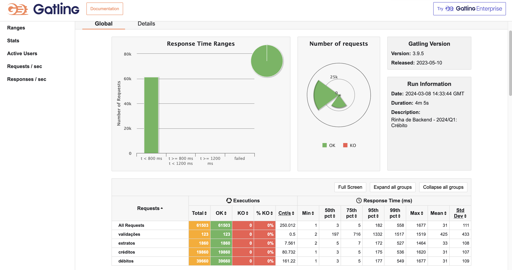

# Submissão para Rinha de Backend, Segunda Edição: 2024/Q1 - Controle de Concorrência

# O que é ?

> A Rinha de Backend é um desafio que tem como principal objetivo
> compartilhar conhecimento em formato de desafio!

Se você quiser saber mais sobre dá um check no [github oficial](https://github.com/zanfranceschi/rinha-de-backend-2024-q1)

# O desafio

O desafio dessa rinha foi tratar de controle de concorrência com o tema **créditos** e **débitos**, basicamente é uma API que recebe requests de transações do tipo CREDITO e DÉBITO. Além desse endpoint deveriar ter um outro onde retornasse as 10 últimas transações de um cliente e seu saldo total (extrato).

# Implementação
Nessa implementação eu decidir sair da zona de conforto, na qual minha stack principal sempre foi usar JAVA e SPRING. Como venho estudando mais sobre Functional Programming com scala, decidir escolher utiliza-la.
Meu objetivo principal não foi ganhar a rinha, mas colocar em prática assuntos que venho estudando de forma teórica, e ganhar mais experiência.

`Scala` para implementação
`Slick` para fazer a integração com o banco de dados que foi `PostgreSQL`
`Javalin` (nunca tinha usando, mas já tinha lido sobre diratamente do site oficial deles)  para ser o framework web.

### Scala, por que?
Por eu está usando como uma linguagem de estudo sobre FP, e por ter interoperabilidade com o java, foi onde me sentir menos desconfortável para caso precise utilizar algumas bibliotecas.

### PosgreSQL, por que?
Como nesse desafio precisavamos manter a consistência dos dados, com um banco de dados SQL é mais simples de implementar esse cenário, já que iria ter momentos de precisar abrir transações criando um conjunto de instruções.
Então decidir utilizar o PostgreSQL por ser um banco de dados SQL e também por já ter familiaridade com o mesmo.

### Slick
Bom o slick eu acabei conhecendo no decorrer da rinha, achei a documentação muito boa, e atendia no que eu preicisava.

# Arquitetura da Rinha

A rinha consiste em trabalhar em uma arquitetura controlada, com requisitos minimos de CPU e Memória

> ### Restrições de CPU/Memória
>
> 
>
> Dentro do seu arquivo docker-compose.yml, você deverá limitar todos os
> serviços para que a soma deles não ultrapasse os seguintes limites:
>
> -   `deploy.resources.limits.cpu`  1.5 – uma unidade e meia de CPU distribuída entre todos os seus serviços
> -   `deploy.resources.limits.memory`  550MB – 550 mega bytes de memória distribuídos entre todos os seus serviços
      > By Rinha Backend - 2024-q1

# Optimistic locking vs pessimistic locking

São abordagens diferentes para lidar com múltiplos acessos concorrentes a dados.

O Optimistic locking, antes de salvar as alterações, o sistema verifica se outros usuários modificaram os mesmos dados. Isso geralmente é feito por meio do uso de um campo de controle de versão.

Já o  pessimistic locking presume-se que conflitos entre operações concorrentes são prováveis (nosso cenário). Portanto, um bloqueio é adquirido nos dados antes de qualquer modificação, garantindo que outros usuários não possam acessar ou modificar os mesmos dados simultaneamente.

Bom no cenário proposto pela rinha, seria possível utilizar esses 2 cenários, acho que dependendo, até um terceiro algo como um lock distribuido.

Mas como eu falei acima do meu objetivo que seria colocar em prática assuntos que venho estudando, e ganhar mais exp, pensando de forma rapida um pessimistic locking seria uma escolha mais assertiva, porém iriamos perder performace.

Tentei com o optimistic locking, mas como esperando, houve algumas incossistencias nos dados porém obtive um bom ganho de performace.

Então acabei optando em usar o pessimistic locking, chegando nesses números:

### Testes de carga usando gatling

### Techstack

 

 

 

 

## André Lucas
Submissão feita com:
- `nginx` como load balancer
- `postgres` como banco de dados
- `scala`  para implementação da API junto com Javalin + Slick
- [repositório da api]()

[@andrelucas.io](https://andrelucas.io/) @ Blog
[Linkedin](https://www.linkedin.com/in/andre-lucastic/) @ Linkedin
[Github](https://github.com/andrelucasti) @ Github